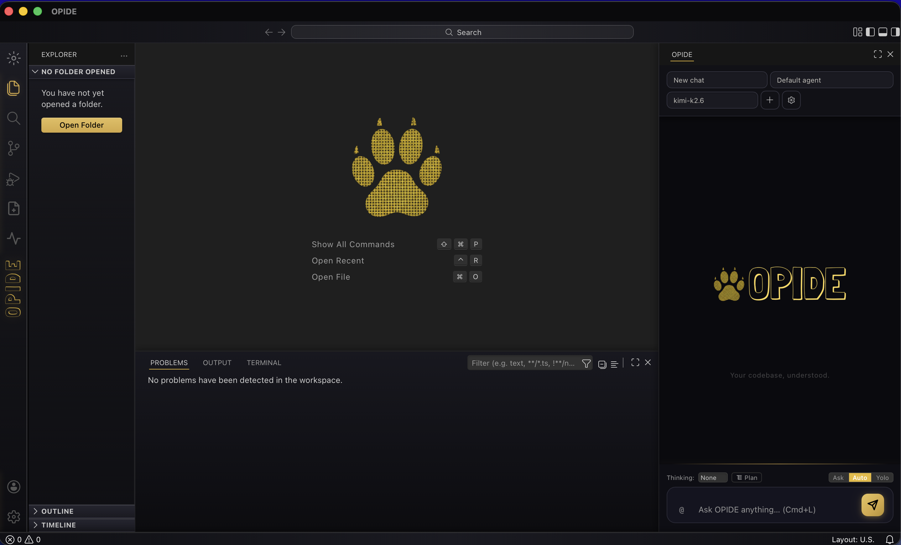
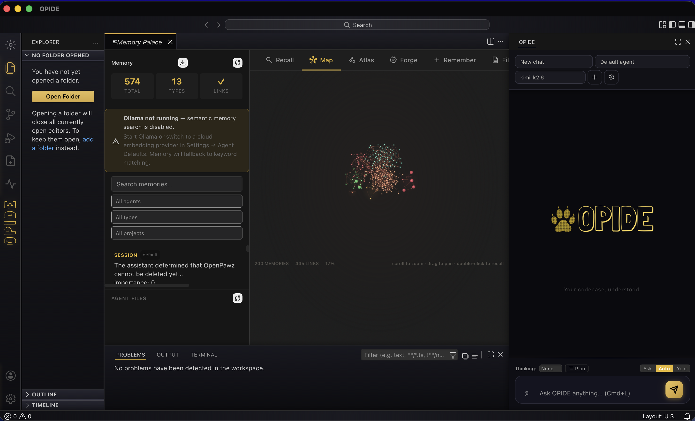
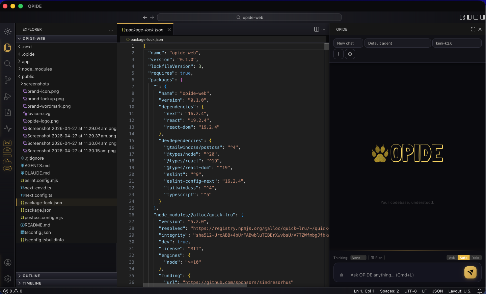
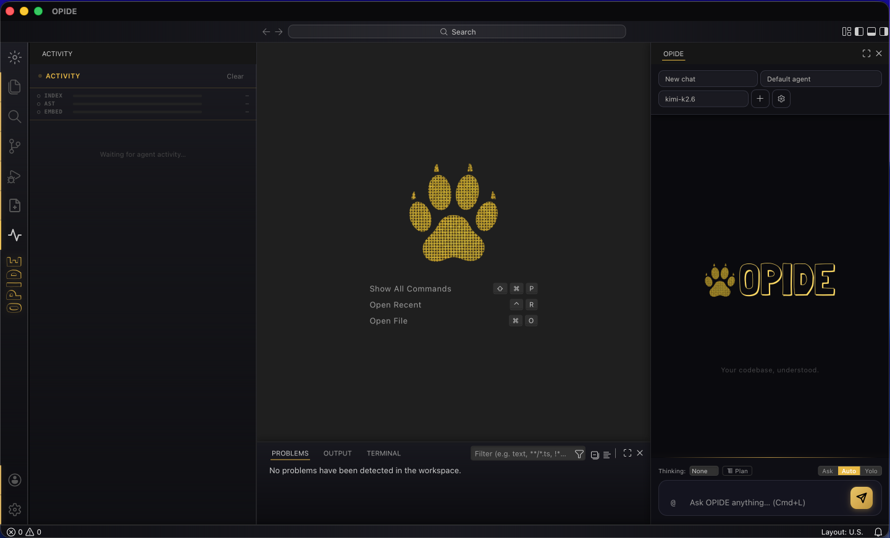
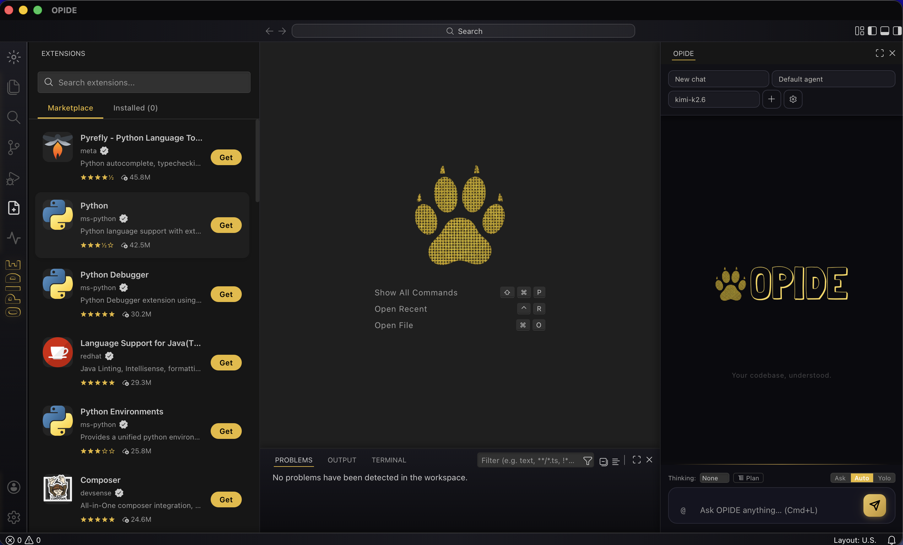

<p align="center">
  
</p>

<h3 align="center">The world's first AI-native IDE built entirely in Rust.</h3>

<p align="center">
  Not a fork. Not a wrapper. Not a clone.<br />
  A ground-up desktop IDE with a biological memory system, configurable agent profiles,<br />
  AST-level code intelligence, and a sandboxed execution engine — all in Rust.
</p>

<p align="center">
  <a href="#what-is-opide">What is OPIDE?</a> &bull;
  <a href="#screenshots">Screenshots</a> &bull;
  <a href="#engram---the-memory-system">Engram</a> &bull;
  <a href="#the-engine">The Engine</a> &bull;
  <a href="#ast-indexing">AST Indexing</a> &bull;
  <a href="#getting-started">Getting Started</a> &bull;
  <a href="#contributing">Contributing</a>
</p>

<p align="center">
  
  
  
  
</p>

---

## What is OPIDE?

OPIDE is a **new class of IDE**. It looks like VS Code — that's where the similarity ends.

Under the surface it's a Rust-native desktop application with a biologically-inspired memory system called **Engram**, 10-layer security architecture, and AST-level code intelligence built on tree-sitter — all in compiled Rust.

The agent doesn't just autocomplete your code. It remembers your codebase across sessions, understands call graphs and type hierarchies, runs sandboxed operations, and encrypts sensitive data at rest with AES-256-GCM — automatically.

**Everything is Rust.** The engine, the memory, the security, the sandbox enforcement, the agent loop, the tool execution. The frontend is TypeScript on Monaco for the editor surface. Everything underneath is compiled, type-safe, and fast.

### Why this exists

Every "AI IDE" today is one of two things: a VS Code fork with a chat panel bolted on, or a cloud editor that sends your code to a server. Both rely on the LLM's context window as "memory" — when the conversation ends, everything is forgotten.

OPIDE is different:
- **It remembers.** Engram gives the agent persistent memory with consolidation, decay, and retrieval — modelled on how biological memory works.
- **It understands structure.** Tree-sitter AST indexing means the agent knows your call graph, type hierarchy, and impact radius without reading every file.
- **It's secure by default.** PII detection, field-level encryption, sandbox enforcement, keychain integration, audit trails — not optional plugins, built into the core.
- **It's owned end-to-end.** The agent engine, the memory, the security, the indexing — all OPIDE-native Rust. No external runtime, no plugin sprawl, no version skew between the IDE and the agent it runs.

---

## Screenshots

<p align="center">
  <br />
  <em>Full IDE — editor, agent chat, terminal, Memory Palace, all in one window.</em>
</p>

<p align="center">
  <br />
  <em>Memory Palace — visualize the agent's long-term memory graph, embedding atlas, and recall pipeline.</em>
</p>

<p align="center">
  <br />
  <em>Monaco-based editor with LSP diagnostics, ghost completions, and the agent panel inline.</em>
</p>

<p align="center">
  <br />
  <em>Activity feed — every tool call, every decision, every approval the agent made, in real time.</em>
</p>

<p align="center">
  <br />
  <em>Open VSX extensions running native in OPIDE.</em>
</p>

---

## Engram — The Memory System

The core innovation. A biologically-inspired three-tier memory architecture spanning 30+ Rust modules.

### Three Tiers

| Tier | Name | What it stores | Lifetime |
|------|------|---------------|----------|
| **0** | Sensory Buffer | Raw input from current turn — messages, tool results, recalled memories | Single turn (ring buffer, 20 items) |
| **1** | Working Memory | Active context — priority-evicted slots with token budgets (4,096 tokens default) | Current session |
| **2** | Long-Term Memory Graph | Persistent knowledge across sessions — episodic, knowledge, procedural | Permanent (with decay) |

### Long-Term Memory Graph

Three interconnected stores with typed graph edges:

- **Episodic** — "what happened." Conversations, events, results. Each memory has an importance score, strength (decays via Ebbinghaus curve), scope, and optional vector embedding.
- **Knowledge** — "what is true." Subject-predicate-object triples. `("Project", "uses", "Rust + TypeScript")`. Auto-reconsolidated when facts update.
- **Procedural** — "how to do things." Step-by-step procedures with trigger conditions and success/failure tracking.

### Advanced Retrieval Pipeline

Not just keyword search. A four-stage pipeline:

1. **Gating** — classifies intent (Skip / Retrieve / Deep / Refuse / Defer). Prevents 40% of unnecessary memory lookups. Based on Self-RAG and CRAG research.
2. **Hybrid Search** — BM25 full-text + vector semantic search across all three stores simultaneously.
3. **Reranking** — Reciprocal Rank Fusion (RRF, k=60), Maximal Marginal Relevance (MMR), cross-type deduplication.
4. **Quality Gating** — NDCG scoring, CRAG 3-tier classification (Correct / Ambiguous / Incorrect). Every search returns quality metrics.

### Consolidation & Decay

Runs automatically every 5 minutes:
- **Pattern clustering** — extracts semantic patterns from episodic memories
- **Contradiction detection** — finds and resolves conflicting knowledge
- **FadeMem dual-layer decay** — LML (beta=0.8) / SML (beta=1.2) Ebbinghaus forgetting curves
- **Garbage collection** — with transactional savepoint rollback to prevent quality degradation
- **Memory fusion** — merges memories with cosine similarity >= 0.75, creates tombstones for superseded entries

### Dream Replay

Hippocampal-inspired background process. When the application is idle, Engram re-embeds memories, discovers new connections, and strengthens important recall pathways.

### Cognitive Modules

- **Emotional Memory** — affective scoring (valence, arousal, dominance) with flashbulb encoding for high-importance events
- **Meta-Cognition** — knowledge confidence mapping and self-reflection
- **Intent Classifier** — 6-intent query routing
- **Entity Tracker** — canonical name resolution across memories
- **Abstraction Tree** — 4-level hierarchical semantic compression for context window packing
- **Memory Bus** — pub/sub event bus with scoped read capabilities for cross-component memory sync

---

## The Engine

OPIDE owns its agent engine end-to-end — a Rust-native AI agent runtime living in `crates/opide-engine/` alongside the IDE.

### Agent Loop

The core execution cycle:
1. **Assemble context** — budget-aware prompt assembly (system prompt capped at 45% of context, history at 35% minimum, reply tokens reserved)
2. **Send to model** — stream through the provider abstraction
3. **Execute tools** — dispatch tool calls through the sandbox
4. **Repeat** — until final response or max rounds

Built-in safety:
- **Tool circuit breaker** — tracks consecutive failures per tool, injects nudges after 3, blocks after 5
- **Repetition detector** — hashes tool call signatures, detects and breaks loops
- **Yield signaling** — graceful interruption when user sends a new message mid-turn
- **Token budget enforcement** — context window never exceeded, budget-aware at every stage

### Configurable Agent Profiles

Each agent in OPIDE is a profile you can configure independently — its own model, system prompt, capability set, and **specialty** drawn from a fixed taxonomy: `coder`, `researcher`, `designer`, `communicator`, `security`, `general`. The model-routing layer resolves per-agent, per-specialty overrides through a 5-level fallback hierarchy.

You switch agents from the chat panel; one agent runs at a time. (Boss/worker orchestration with goal decomposition and automatic delegation is on the roadmap, not in the current build.)

### 10 AI Providers

| Provider | Implementation |
|----------|---------------|
| Anthropic | Native Messages API |
| Google | Native Gemini API |
| OpenAI | Native API |
| DeepSeek | OpenAI-compatible |
| Moonshot (Kimi) | OpenAI-compatible |
| xAI (Grok) | OpenAI-compatible |
| Mistral | OpenAI-compatible |
| OpenRouter | OpenAI-compatible |
| Ollama | Local models, OpenAI-compatible |
| Custom | Any OpenAI-compatible endpoint |

Every provider implements the `AiProvider` trait — streaming, tool use, thinking/reasoning tokens, model capability detection. Model routing resolves per-agent overrides, falling back through a 5-level hierarchy.

### MCP Server Support

Full Model Context Protocol integration:
- **Stdio transport** — spawns MCP servers as child processes
- **SSE transport** — HTTP long-polling for remote servers
- Tool discovery, invocation, and result validation
- Multi-server lifecycle management with health monitoring

---

## AST Indexing

Tree-sitter powered code intelligence. Not grep. Not regex. Actual parsed ASTs.

### Supported Languages

Full tree-sitter parsing: **TypeScript, JavaScript, TSX, JSX, Rust, Python, Go, C, C++, Java, Ruby, CSS, JSON**
Typed AST parsing: **Solidity** (via solang-parser)
Regex extraction: **Move, COBOL, Fortran**

### What Gets Indexed

Every file produces a `FileIndex`:
- **Symbols** — functions, classes, types, traits, interfaces
- **Imports** — local and external dependencies
- **Exports** — public API surface
- **Call sites** — who calls whom, with position data
- **Type references** — type hierarchies and usage
- **Scopes** — lexical scope information

These roll up into a `ProjectIndex` with a full dependency graph, framework detection, entry point identification, and config file tracking.

### Agent Tools

The agent queries the index directly:

| Tool | What it does |
|------|-------------|
| `ast_callers` | Find every caller of a function across the entire codebase |
| `ast_callees` | Trace what a function calls |
| `ast_impact` | Predict what breaks if you change something |
| `ast_definition` | Jump to definition |
| `ast_type_info` | Understand type hierarchies |
| `search_semantic` | Find code by meaning (embedding-based) |
| `search_text` | Find code by keyword |

The agent understands your codebase structure without reading every file. It knows call graphs, impact radius, and type relationships before it writes a single line.

---

## 10-Layer Security

Security is not a feature — it's the architecture.

| Layer | What it does |
|-------|-------------|
| **1. Rust type system** | No null pointers, no data races, no use-after-free. Compile-time guarantees. |
| **2. Memory encryption** | PII detected via 20 regex patterns + LLM classification. Three tiers: Cleartext, Sensitive (AES-256-GCM + searchable summary), Confidential (fully encrypted, vector-only search). |
| **3. Sandbox enforcement** | All file operations forced through QuickJS sandbox with HostApi trait. No raw filesystem access from agent. |
| **4. Tool circuit breaker** | Blocks tools after 5 consecutive failures. Prevents infinite loops and resource exhaustion. |
| **5. MCP isolation** | External MCP servers run in separate processes. Tool results validated before injection. |
| **6. Keychain integration** | API keys stored in OS keychain (macOS Keychain, Linux secret-service). Single unlock, encrypted at rest. |
| **7. Token budget enforcement** | Context window never exceeded. Prevents context overflow attacks. |
| **8. GDPR compliance** | Automatic PII tier escalation, key rotation with re-encryption, memory purge capabilities. |
| **9. Audit trail** | Every operation logged — agent actions, tool calls, memory access, security decisions. Queryable history. |
| **10. SQLite encryption** | Database encrypted at rest. Anti-forensic measures: file size masking, metadata zeroing. |

---

## The Sandbox

The agent executes code in a **QuickJS** (rquickjs) sandbox with a controlled `HostApi`:

```js
function run(ctx) {
  var src = ctx.file_read("src/app.ts");
  src = src.replace("oldFunction", "newFunction");
  ctx.file_write("src/app.ts", src);
  var result = ctx.exec("npm test");
  return { success: result.exit_code === 0 };
}
```

The `ctx` object exposes: `file_read`, `file_write`, `dir_list`, `exec`, `git_status`, `git_diff`, `git_log`, `git_branches`, `search`, `get_diagnostics`, `get_selection`, `get_open_files`.

No raw filesystem access. No network access. No child process spawning outside the HostApi. The host controls exactly what the agent can do.

---

## Open VSX Extensions

OPIDE does **not** use VS Code's proprietary extension marketplace. It uses **Open VSX** — the open-source extension registry at [open-vsx.org](https://open-vsx.org), which provides thousands of compatible extensions without any Microsoft lock-in.

Extension support ships with the OPIDE app today. The runtime implementation is held back from this open-source repository because it's part of the paid product surface — public API stubs are provided here so the codebase compiles and runs without it. The full extension runtime is included in the published OPIDE program.

---

## Editor

The editor surface is Monaco — the same editor core as VS Code. It provides:
- Syntax highlighting, IntelliSense, code folding
- LSP diagnostics with inline error markers
- Ghost completions (inline suggestions with Tab-to-accept)
- Inline edit (Cmd+K) with selection-aware code transformation
- Integrated file explorer, search, terminal
- Git integration with diff viewer

The editor is the interface. Everything else — the agent, the memory, the security, the indexing — is Rust underneath.

---

## Architecture

```
OPIDE
├── src/                    # TypeScript — Monaco editor surface, chat UI, Memory Palace
├── src-tauri/              # Tauri shell — window management, plugin stack
├── crates/
│   ├── opide-engine/       # The agent engine
│   │   └── src/engine/
│   │       ├── agent_loop/     # Core agent execution cycle
│   │       ├── engram/         # Memory system (23 modules)
│   │       ├── orchestrator/   # Multi-agent boss/worker
│   │       ├── providers/      # AI provider implementations
│   │       ├── mcp/            # Model Context Protocol integration
│   │       └── ...
│   ├── opide-ai/           # AST indexer, tool executor, sandbox bridge
│   ├── opide-bridge/       # Hook traits: ToolAssembler, ProviderFactory
│   └── opide-shell/        # Terminal, git, LSP, DAP, file watcher, extensions
└── opide-sandbox/          # QuickJS execution sandbox (rquickjs)
```

OPIDE owns the engine end-to-end. The bridge layer (`opide-bridge`) connects the engine to OPIDE-specific behavior through Rust traits — `ToolAssembler`, `ProviderFactory`, `ExternalToolExecutor` — keeping the engine layer decoupled from the IDE workbench so each can evolve independently.

---

## Getting Started

### Prerequisites
- **Rust** 1.75+ with `cargo`
- **Node.js** 18+ with `npm`
- **Tauri CLI** — `cargo install tauri-cli`

### Build & Run

```bash
git clone https://github.com/OpenPawz/OPIDE.git
cd OPIDE
npm install
npm run tauri:dev
```

First build compiles the Rust backend (~2-3 min). Subsequent launches are fast.

### Configure a Provider

On first launch, the provider setup panel appears. Pick a provider, paste your API key, select a model, and you're ready. Add more providers and configure model routing in **Settings** (Cmd+,).

---

## Contributing

We welcome contributions — open an issue or submit a PR.

1. Fork the repo
2. Create a feature branch (`git checkout -b feat/my-feature`)
3. Make your changes
4. Run `cargo check` to verify Rust compiles
5. Run `npm run tauri:dev` to test
6. Submit a PR

### Areas We'd Love Help With
- **Tree-sitter grammars** — add parsing for more languages
- **Open VSX extensions** — build extensions that integrate with the agent
- **MCP servers** — build and share tool servers
- **Engram research** — memory consolidation, retrieval strategies, decay models
- **Security** — audit, pen testing, encryption improvements

---

## License

OPIDE is licensed under the [Apache License 2.0](LICENSE).

---

<p align="center">
  <br />
  Built by <a href="https://github.com/OpenPawz">OpenPawz</a>
</p>
