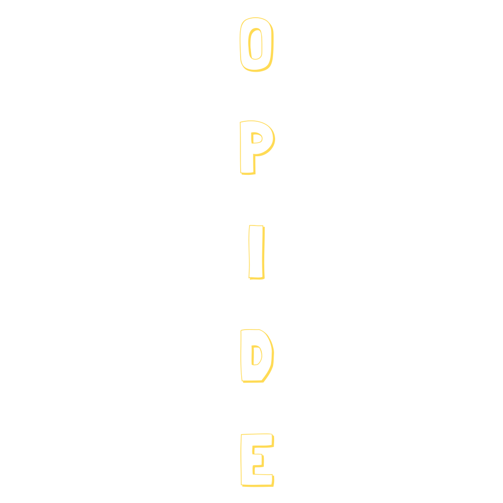

<p align="center">
  
</p>

<h3 align="center">The AI-Native IDE</h3>

<p align="center">
  A desktop IDE with a built-in AI coding agent, AST-level code intelligence, and a sandboxed execution engine.<br />
  Bring your own API key. Use any model. Ship faster.
</p>

<p align="center">
  <a href="#features">Features</a> &bull;
  <a href="#getting-started">Getting Started</a> &bull;
  <a href="#supported-providers">Providers</a> &bull;
  <a href="#architecture">Architecture</a> &bull;
  <a href="#contributing">Contributing</a>
</p>

<p align="center">
  
  
  
  
</p>

---

## What is OPIDE?

OPIDE is a native desktop IDE built on Rust + Tauri with a full Monaco editor and an AI agent that doesn't just suggest code — it writes, edits, tests, and ships it.

Unlike cloud-based AI editors, OPIDE runs entirely on your machine. You bring your own API keys, choose your model, and the agent works with real tools: filesystem access, terminal, git, and deep code understanding through AST analysis.

<p align="center">
  
</p>

## Features

### AI Agent with Real Tools
The built-in agent doesn't just write code in a chat window. It has direct access to:
- **File read/write/edit** — creates and modifies files directly
- **Terminal execution** — runs builds, tests, linters, any shell command
- **Git operations** — stage, commit, diff, log, branch management
- **Web browsing** — fetch documentation, search the web, read URLs
- **Sandboxed execution** — batch multi-step operations in a single JavaScript sandbox call

### AST-Level Code Intelligence
OPIDE indexes your codebase with tree-sitter and builds a full call graph:
- **`ast_callers`** — find every caller of a function across the entire codebase
- **`ast_callees`** — trace what a function calls
- **`ast_impact`** — predict what breaks if you change something
- **`ast_definition`** — jump to definition instantly
- **`ast_type_info`** — understand type hierarchies
- **Semantic search** — find code by meaning, not just keywords

The agent uses these tools natively — it understands your codebase structure without reading every file.

### Execution Sandbox
The `execute_code` sandbox lets the agent batch operations:
```js
function run(ctx) {
  var src = ctx.file_read("src/app.ts");
  src = src.replace("oldFunction", "newFunction");
  ctx.file_write("src/app.ts", src);
  var result = ctx.exec("npm test");
  return { success: result.exit_code === 0 };
}
```
One round trip instead of ten. All file changes go through the diff editor for review.

### Full Monaco Editor
Built on the same editor as VS Code, with:
- Syntax highlighting, IntelliSense, code folding
- Integrated file explorer, search, terminal
- O VST extension support
- Multi-window support
- Git integration with diff viewer

### BYO API Key — Any Provider
Configure any AI provider from the settings panel:

| Provider | Models |
|----------|--------|
| Anthropic | Claude Opus, Sonnet, Haiku |
| OpenAI | GPT-4o, o3, o4-mini |
| Google | Gemini 2.5 Pro, Flash |
| DeepSeek | DeepSeek Chat, Reasoner |
| Moonshot | Kimi K2 |
| xAI | Grok 3 |
| Mistral | Large, Small, Codestral |
| OpenRouter | Any model via routing |
| Ollama | Any local model |
| Custom | Any OpenAI-compatible endpoint |

Model routing lets you use a powerful model for orchestration and a cheap model for simple tasks.

### MCP Server Support
Connect external tools via the [Model Context Protocol](https://modelcontextprotocol.io). MCP servers appear as tools the agent can call — extend OPIDE with any capability.

## Getting Started

### Prerequisites
- **Rust** 1.75+ with `cargo`
- **Node.js** 18+ with `npm`
- **Tauri CLI** — `cargo install tauri-cli`

### Build & Run

```bash
git clone https://github.com/OpenPawz/OPIDE.git
cd OPIDE
npm install
npm run tauri dev
```

First build compiles the Rust backend (~2-3 min). Subsequent launches are fast.

### Configure a Provider

On first launch, the provider setup panel appears. Pick a provider, paste your API key, select a model, and you're ready to go. You can add more providers and configure model routing in **Settings** (Cmd+,).

## Architecture

```
OPIDE
├── src/                    # TypeScript frontend (Monaco, chat, UI)
│   └── opide/
│       ├── chat/           # Agent chat panel, streaming, system prompts
│       ├── editor/         # Monaco editor integration
│       └── ...
├── src-tauri/              # Tauri entry point, window management
├── crates/
│   ├── opide-ai/           # AI engine: tool execution, model routing
│   ├── opide-bridge/       # Tool filtering, procedural memory
│   └── opide-shell/        # Git operations, terminal management
├── opide-sandbox/          # JS execution sandbox (rquickjs)
├── OpenPawz/               # Core engine (state, providers, agents)
└── extension-adapters/     # O VST extension system
```

**Powered by [OpenPawz](https://github.com/OpenPawz)** — the engine handles provider management, agent state, conversation history, key vault, and the model routing layer.

## Contributing

We welcome contributions! See [CONTRIBUTING.md](CONTRIBUTING.md) for guidelines.

**Quick start:**
1. Fork the repo
2. Create a feature branch (`git checkout -b feat/my-feature`)
3. Make your changes
4. Run `cargo check` to verify Rust compiles
5. Run `npm run tauri dev` to test
6. Submit a PR

### Areas We'd Love Help With
- **Language support** — tree-sitter grammars for more languages
- **O VST extensions** — build extensions that integrate with the agent
- **MCP servers** — build and share MCP tool servers
- **UI/UX** — themes, layouts, accessibility
- **Documentation** — guides, tutorials, examples

## License

OPIDE is licensed under the [GNU Affero General Public License v3.0](LICENSE).

You are free to use, modify, and distribute OPIDE. If you run a modified version as a service, you must make your source code available under the same license.

---

<p align="center">
  Built by <a href="https://github.com/OpenPawz">OpenPawz</a>
</p>
